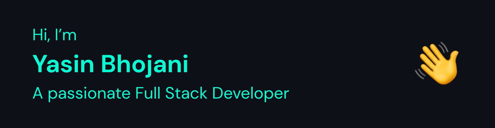

## 🙋‍♂️ About Me

---

- 🔭 Working on becoming a **Fullstack Developer⚡**

- 🌱 I’m currently learning **TypeScript and DSA** 

- 💬 Ask me about **JavaScript, React, Node, Express**

- 📫 How to reach me yasinbhojani333@gmail.com

 

## 🚀 Languages and Tools

---

 
  
  
  
  
    
   
   
   
   
   
  
     
   
  

 

I love exploring new technologies and would love to collab on open source projects. I am currently learning more and more about web technologies, and I am curious to work with other people ahead.

 

## 📊 My Github Stats

---

   
    
  

    

    

 

  

